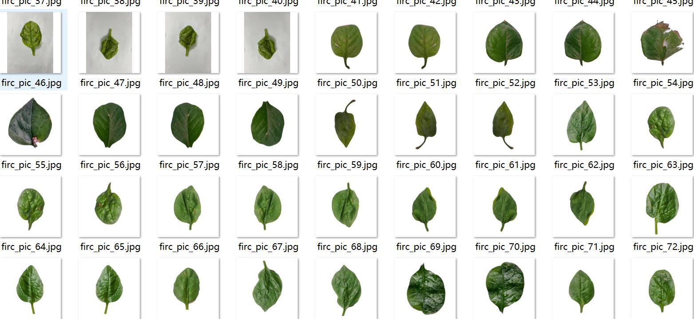
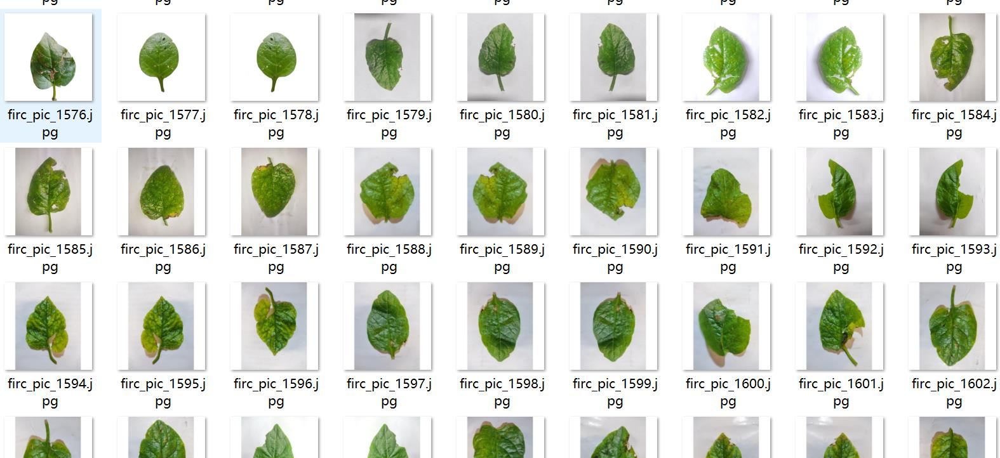
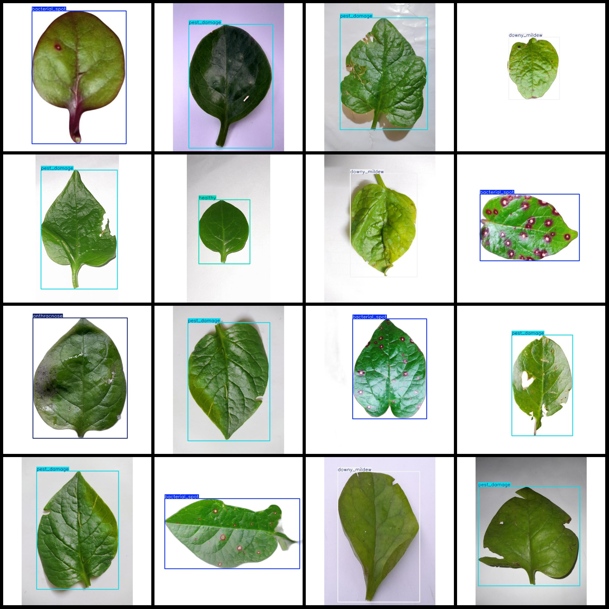
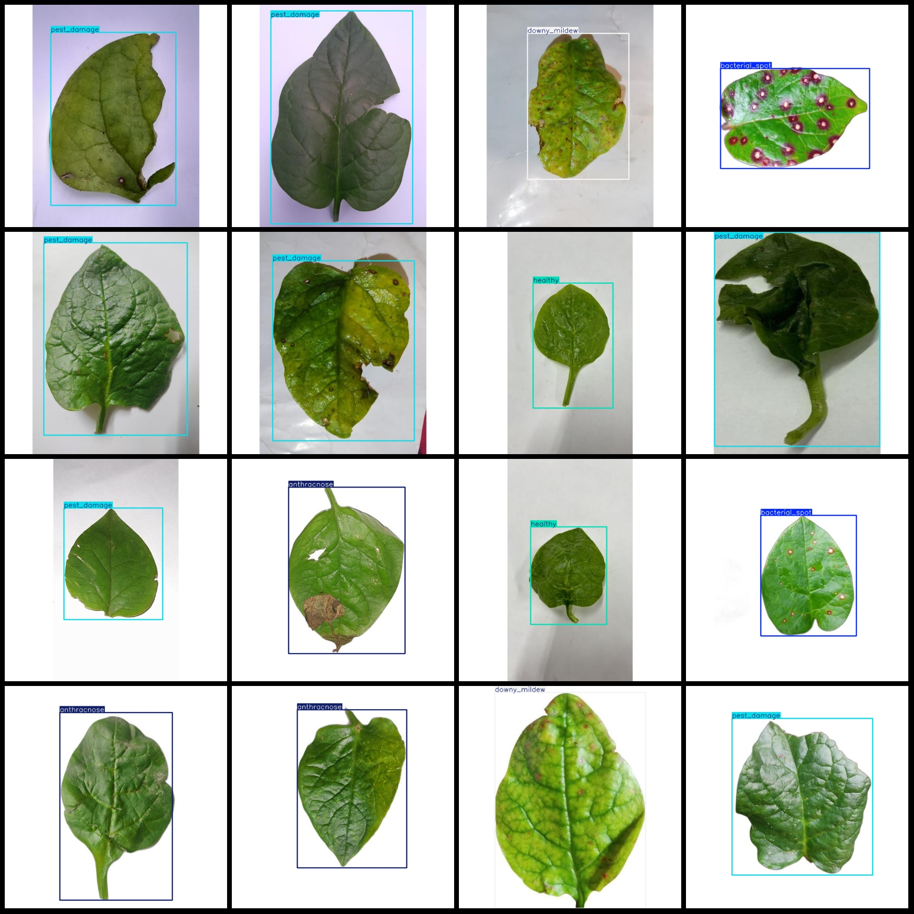

# Leaf Disease Detection Dataset VOC+YOLO in 1735 Images with 5 Categories of Single Leaf

Pascal VOC format+YOLO format (without split path in txtfile, only contain jpgimage and corresponding VOC format xmlfile and yolo format txtfile)
number of images: 1735  
annotation count: 1735  
annotation count: 1735  
annotationnumber of classes: 5  
Annotation class names (Note: the order of yolo format classes does not correspond to this, but is based on the labels file's classes.txt): ["anthracnose", "bacterial_spot", "downy_mildew", "healthy", "pest_damage"]
boxes per class:   
Anthracnose (Box Count = 200)
Bacterial spot, also known as bacterial decay or bacterial spore disease, is a type of fungal infection that affects the skin and soft tissues of plants. It is caused by the bacterium Pseudomonas syringae pv. phaseolicola, which produces a toxin called pyocins that cause the plant's cells to burst and rupture.

The symptoms of bacterial spot are characterized by small, round, water-soaked spots on the surface of the plant. These spots may be green, brown, or black in color, depending on the species of plant and the severity of the infection. The spots can also appear as small, raised bumps or as large, necrotic patches.

Bacterial spot is most commonly seen in vegetables such as lettuce, spinach, and turnips, but it can also affect other crops such as beans, peas, and carrots. The disease can be spread through contaminated soil, water, or air during planting or harvesting.

Prevention measures include proper crop rotation, avoiding overcrowding plants, maintaining clean soil, and using resistant varieties of plants. In addition, regular monitoring for signs of bacterial spot is important to identify and treat the disease early on.
Downy mildew (mildew) box count = 363.
Healthy box counts are a measure of the number of boxes that contain healthy items. The total count for a given period can be calculated by adding up all the healthy box counts.
Pest damage (insect damage) box count = 580
total boxes: 1735  
images per class:   
anthracnose images = 200
bacterial_spot images = 391
downy_mildew images = 363
healthy images = 201
pest_damage images = 580
image resolution: 640x640  
Use annotation tool: labelImg
Annotation rules: draw a rectangle box around the class.
Important notes: The dataset needs to be divided into training, validation, and test sets.
Special statement: This dataset does not guarantee the accuracy of the trained model or weight file.
Image preview:
## Images

Here is a pay link on Stripe ( https://buy.stripe.com/3cs8yP7sY87d0vu9AB ). Please contact me lonlonago@foxmail.com after funding $89, and I will send you a complete data files , thank you!

